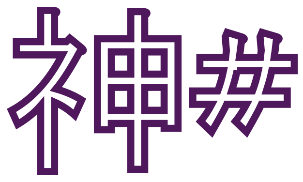

# 

Making a second attempt at implementing a certified Shen implementation. This time using F# to learn F# and functional idioms.

Shen 19 doc can be found here:

http://www.shenlanguage.org/documentation/shendoc.htm

The proper order for browsing the KL interpreter is as follows:
  * [Types](https://github.com/rkoeninger/ShenSharp/blob/master/Kl/Types.fs)
  * [Reader](https://github.com/rkoeninger/ShenSharp/blob/master/Kl/Reader.fs)
  * [Evaluator](https://github.com/rkoeninger/ShenSharp/blob/master/Kl/Evaluator.fs)
  * [Builtins](https://github.com/rkoeninger/ShenSharp/blob/master/Kl/Builtins.fs)
  * [Startup](https://github.com/rkoeninger/ShenSharp/blob/master/Kl/Startup.fs)

Status:
  * I can generate F# using FSharp.Compiler.Services, but it's really slow
  * I can generate F# by string concatenation (Fex), but it crashes when you try to compile it
    * It crashes with a StackOverflowException, no warnings or error messages
    * I've read that this might be caused by excessively long F# lambdas
      * I could try to do lambda lifting to address this
  * Evaluator is still very slow
  * Shen Tests still do not pass
  * Need to package relevant FSharp.Core.dll,.optdata,.sigdata with Kl.dll, etc.
